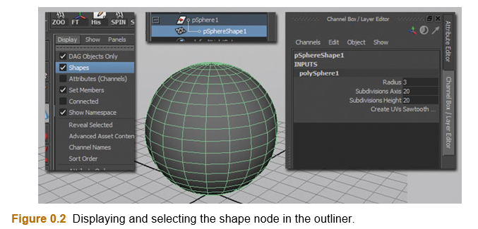

# Rig it Right

## 致谢(Acknowledgments)

亲爱的读者

角色创建(Character Setup)，也就是Rig，一个非常古老的话题。  
我所教授的课程，是所有动画师的必修课，我的目标至少是使学生们充分了解创建Rig的过程以使他们在更高层次的项目中创建Rig，使他们在工作生涯中可以成长为一名角色创建艺术家。要知道这是非常困难的，动画师必须正确完成才能更好的控制动画。简而言之，我希望学生们学会尊重他们的角色创建艺术家。  
我发现过去10年中的所有Rig课程我都参与其中，学习，教学并且学到更多，每个班级可能只有一个真正有欲望并且热爱创造(Craft)立志成为一名角色创建艺术家的人。这些人中，只有那些会写脚本(Script)或代码(Code)的人会逐渐成长为一名完全成熟的动画导演。班级中还有一部分学生，当他们的工作需要时，有一些会理解并做到这一点。(我收到的学生们的Email，他们向我保证，如果不会做最基本的Rig，他们将不会找到工作。最近我看了一个学生的Facebook，他解决了一个Rig问题并感谢我让他这么做！多好。)然后是剩下的学生们 —— 那些当我问他们是否想继续做Rig的时候，只会摇摇头并羞怯地笑的学生。我很少见到一个学生完全不会做的，通常是他们可以做但是达不到生产水平(Production Level)。然而，他们总是会从课堂上获取足够的知识来帮他们理解并和角色创建艺术家交流。  
问题是，你属于哪一类？无论答案是什么，你都可以从这本书中学到很多。我已经把内容分成了基础(Basic)和高级(Advanced)两部分，在基础内容中，我们将会做基础的Rig，然后为我们自己的两足角色创建Rig。每一过程我都会讲解方法(Methodologies, a fancy word for rules)来引导你解决遇到的任何角色创建问题。最终，我希望你可以继续阅读这本书的高级部分，并且可以自己融会创建Rig的方法，然后提出自己的方法。  
我该如何学习？我在生涯中听到过很多角色创建艺术家这样说。我坐在他们的教室中，我看他们的Rig，我分开它们，打破它们，修复它们，又打破它们一点。过了一会，我注意到我已经有了一个关于什么可行和什么不可行的明确的观点。不是每一位角色创建艺术家都会和你分享相同的观点，因为这个主题有上百种方法并且它们都可行。我的方法基于我开发的规则(Methodologies)来指导我。我要对那些我求学的人，教我的人，提出我问题的人表达感谢：Jason Osipa (“Beyond Blendshaping” class at EA), Jason Schliefer (允许我使用他的脚本并提供帮助), Craig Caldwell (“Rigging the Bond Girls” class at EA), Jayme Wilkenson (whether to lock controls or not lock controls and IK vs. FK debates), Chris Christman (“Intro to Rigging” class at Disney)，和验证我的方法，给予反馈，探索我的新点子的可行与不可行的数百位学生。再次感谢你们，你们真的读完整页了吗？好了，我们开始谈正事吧。

## 介绍

### Rig的基础准则

在我的“角色创建介绍”课程中，我通常都是一次一个的做这些准则(Rules)，但是，因为我们都聚集在了相同的一页，如果不讲一下我们使用这本书的准则，似乎有些浪费。这些准测从哪里来？它们来自多年对Rig的观察，生产环境中对Rig的观察，对Rig的解剖，将Rig放到组项目中，看它们破碎，修复它们，看它们起作用，读和看每一个我见过的Rig，然后，我意识到我已经发展出了一种对某些Rig喜欢和不喜欢的观点。(如果你阅读了之前的部分，你已经知道这个了。)我最后将这些观点整理作为我对Rig的准则。这些将不会是所有人的准则，角色创建是一个非常主观性的事。使事物复杂化，有上百种方法可以做任何事，这使得学习变得极具挑战性。这本书中，我们将会使用这些准则并经常引用它们。我发现如果我将此作为基础部分的底线来开始课程的话，将有助于管理学习进程并且可能抑制一些混乱。之后，当你进入高级部分的时候，你可以选择打破或者完全忽略某些准则，并发展出你自己的Rig准则。我们将会在接下来的章节中更多的介绍这些准则，现在，这些准则是：

1. Edgeloops —— 一个好的或坏的Rig从循环开始。
2. 不要在几何(Geometry)上设置关键帧(KeyFrame)(Rig for change)。
3. 锁定(Lock)不需要设置动画的部分。
4. 在总览(Outline)中使几何(Geometry)、控制器(Control)、骨骼(Skeleton)处于不同的组中。
5. 使控制器对动画师友好。
6. Happy math - 控制器和关节(Joint)应该归零。
7. Happy history - 切记删除不需要的历史以使处理Rig的速度更快。
8. 关节的位置、首选角度和方向：不好的关节位置可以使好的模型变坏。做Rig之前要额外注意这点 —— 否则你将需要重做你的Rig。
9. BlendShape —— 永远不要冻结(Freeze)它。
10. 蒙皮(Skinning) —— 对它友好点 —— 好的Rig配上糟糕的蒙皮依旧很糟糕。

这像一个神秘的预告片，是么？听起来很残酷，对么？蒙皮和数学，到底怎么回事？不要担心，我可以明确地告诉你，在这本书中，你不需要掌握大量的数学知识，相反，你需要有强逻辑性和很好的问题解决能力。  
还有，这本书认为你已经使用过Maya工作，并且对模型(Model)有一个基本的了解(至少是一些多边形模型(Polygon Model))，甚至可能已经尝试过设置关键帧。因此，这不是一本以“如何移动摄像机”或者“在Maya中如何转向”为第一讲解要义的书。如果你需要复习这些知识，有许多地方可以学习，Lynda.com, learning-maya.com, 仅举几例。  

### 控制你的总览/超图(Hypergraph)/历史

在我们直接创建你的第一个Rig并兴高采烈地给他做动画前，让我们来看一下你之前可能没见过的Maya中的几个重要主题。我们将不会花费太多时间在这方面，真的。

### 节点(Node)介绍

你如果翻开任何一本关于Maya的书，将会发现关于这个主题的讨论会非常多。了解Maya基于节点工作的基本原则是非常重要的，因此我们也会讨论这个主题。到现在，你也许已经使用过Maya建模和做动画，这是一个理解的层次：就像开一辆车。你知道油门和刹车踏板的位置；你知道如何给汽车加油；可能你有一个更高层次的理解，比如知道发动机如何工作。但是你不能准确精细地描述出发动机的内在部件是如何工作的。  
我们以一个简单的物体作为课程的开始。在一个只有一个多边形球体的场景中，似乎只有一个球和摄像机，对么？你要知道我在引导你，当然，还会有其他的东西。也许你甚至有一个Clue，因为根据之前创建模型的经验，你已经调整了球的输入属性(Inputs Attributes)。还没有调整的话，看一下Channel选项卡下的inpus，你将会发现可以调整的原始(Primitive)属性。你可以调整半径(Radius)，细分轴(Subdivisions Axis)，细分高度(Subdivisions Height)等等。如果你在Channel选项卡的inputs下没有看到这些属性，确保打开了历史(History)选项并重新创建多边形球。  
```
Note: 你可以选择属性的名称(例如，细分高度)，然后在主窗口中按下你的滚轮键(Middle Mouse Button)并左右拖动来使用虚拟滑动条(Virtual Slider)。
```
inputs准确来说是什么意思？好，我们回到Nodes的概念。每个物体(Object)初始都有两个Node，你可以把一个Node理解为一个包含某些信息并用这些信息做某些事情的盒子(Box)。物体的两个Node就是：变形节点(Transform Node)和形状节点(Shape Node)。  


当你选中球的时候，如果你看Channel选项卡，你会看到这两个Node所表示的含义。Transform Node包含了物体的所有位置信息，你知道这是位移(Translate)，旋转(Rotate)和缩放(Scale)信息。你可能不知道的是你做的所有动画的关键帧(Keyframe)都是基于所谓的变形节点，好了，所以当你在鸡尾酒聚会上拿起另一个热狗(pig-in-a-blanket)的时候，你可以有一些有趣的事说了: "...当然，我给变形节点打关键帧，Thurston，这些热狗是辣味的吗?"  
如果变形节点明确物体的位置，那么你认为形状节点是做什么的呢? 如果你说它是用来明确物体的外形——你答对了。形状节点整合它所有的输入(input)来明确物体最终的外形。默认的，原始形状(Shape)有一些你可以调整的内建属性，像高度(height)和宽度(width)。但是，你可以对原始形状调整更多，用你的基础建模经验。我们过会儿会讨论这个。  

### 如何找到变形和形状节点

有两种主要的方法找到形状节点。一般地，你应该只单纯地使用变形节点在接触Maya的最初职业生涯中。形状节点通常对普通用户隐藏，因为会误导他们。这就好像你开车一直踩着油门一样，这是不明智的。  
  
找出形状节点的第一种方法是通过选择**Window > Outliner**或者**Perspective/Outliner**预设打开大纲窗口。在大纲窗口你可以看到你的物体列表(Object List)；那是变形节点。请不要相信我——